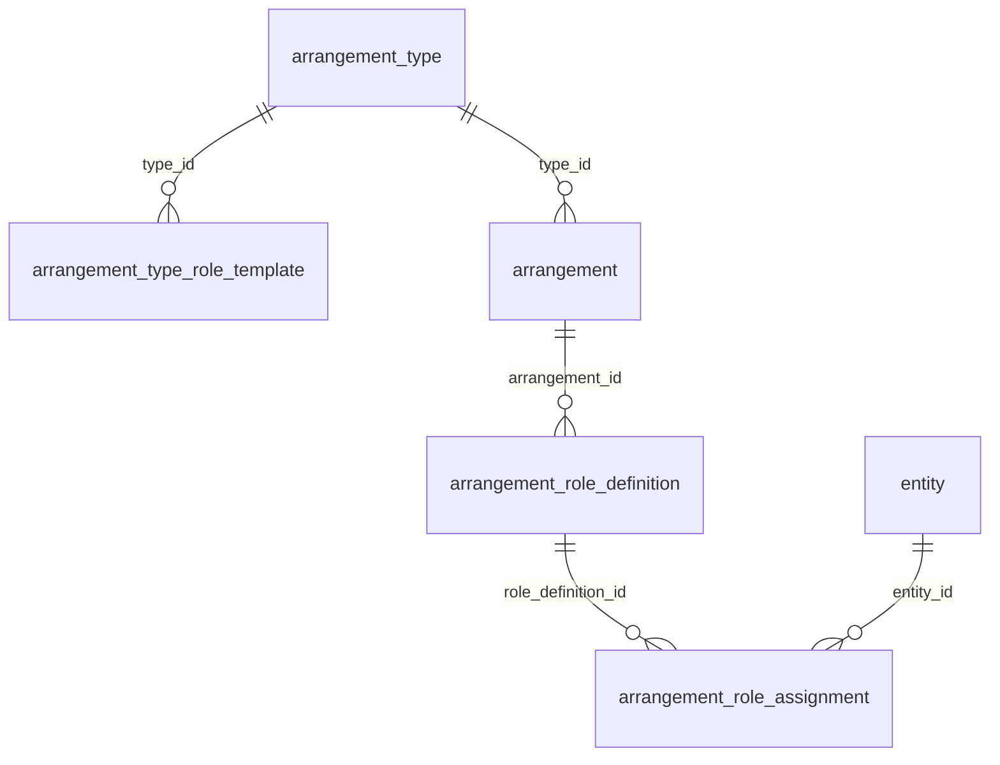

# LifeOR2 data model redesign

Date: 2026-09-15  
Status: implementation handoff specification; product decisions consolidated from the design discussion. Physical schema defaults below are recommendations unless explicitly identified as confirmed decisions. No application or database migration has been performed by writing this document.

This document supersedes conflicting modeling guidance in [the original specification](spec_0.1.md). Read [implementation status](../../IMPLEMENTATION_STATUS.md) for what actually exists. The adjacent personal-finance project supplied useful requirements, not a schema to copy.

Reading guide: [decisions and scope](#1-purpose-and-scope) · [shared contracts](#3-shared-data-contracts) · [arrangements and roles](#5-arrangements-types-roles-and-subjects) · [Git details](#9-git-owned-details) · [accounting](#10-accounting-accounts-and-financial-attribution) · [examples](#14-complete-worked-examples) · [migration](#15-migration-from-the-current-prototype) · [implementation and acceptance](#16-implementation-sequence-and-acceptance).

## 1. Purpose and scope

Model the family's people, organizations, assets, relationships, occurrences, observations, and finances with persistent identity, recoverable history, and understandable financial meaning. Support later spending/beneficiary reports, evidence-backed monetary obligations, reliable balances, and reproducible forecasts without implementing those product experiences now.

The implementation assignment is **data foundations**: schemas, typed relationships, invariants, migration, essential domain writes/reads, and compatibility with existing callers. It is not a dashboard, report-builder, bank connector, document-extraction system, reminder system, or forecasting engine assignment.

The design no longer attempts to fit every concept into six universal primitives. Use simple domain records when their semantics or constraints justify them. Do not build a universal graph engine, generic property database, or new application framework.

### 1.1 Confirmed product decisions

1. Entities are identifiable **instances**, not abstract classes or roles. Acme Corporation and a named streaming service are eligible; “employer” and “streaming service” as abstract labels are not entities.
2. Projects are **tags**. Many records can have many tags. A tag may have freeform Markdown details. No project or collection table, project lifecycle, automatic membership, hierarchy, or special project behavior is required.
3. Arrangement types are freely creatable. Each type can supply role templates; each arrangement defines its own roles and entity assignments. Seeded roles are suggestions, never a fixed global vocabulary.
4. Projects, budgets, plans/scenarios, charts of accounts, valuations, and FX observations are not arrangements. Pipeline opportunities, love, and entertainment preferences are outside this app's model.
5. Remove the generic Property primitive. Domain objects can have Markdown details with optional front matter. Promote an attribute into a typed database field when actual requirements justify it.
6. **Git owns Markdown documents.** Git provides history and diffs. Concurrent document editing and merge resolution are deferred; phase 1 assumes one document writer.
7. Measurements represent quantities, with clear observed/expected/derived/contractual meaning. Schedules are typed rules, not measurements.
8. Ordinary terms are not automatically sub-arrangements. Use a sub-arrangement only for an independently meaningful relationship.
9. Explicit obligations and settlement machinery are **monetary only**.
10. Preserve the balanced journal as the authoritative accounting representation. Attribution, observations, obligations, and forecasts must not become independently editable copies of the ledger.
11. Prepare the data for useful reports and planning. Do not implement dashboards or reporting features as part of this redesign.

### 1.2 Implementation defaults, not new product commitments

- Keep the name `arrangement`; no rename to `relationship` was agreed.
- Keep the existing authenticated-user ownership boundary. Do not introduce workspace sharing or family viewer roles in this pass.
- Use explicit revision records for structured facts and Git revisions for Markdown. Do not use Git to replace financial/effective-time history.
- Keep entity kinds as descriptive, validated nonempty labels initially; no entity-type customization framework is needed.
- Use a separate content repository for Markdown. Its location is deployment configuration, not a hardcoded path in records.
- Use integer minor units for money. Support a declared currency precision; never aggregate different currencies without an explicit conversion policy.
- Keep financial-account metadata as a typed extension of a banking/loan arrangement, with explicit ledger mapping. Avoid a second entity identity for the same account.
- Use ledger accounts for initial expense/income classification; a separate category hierarchy is deferred.

An implementor can refine physical table names, indexes, and bounded storage layouts while preserving these contracts. Changing a confirmed decision requires a product decision, not an incidental implementation shortcut.

## 2. How to choose an object

| Question | Object | Example |
| --- | --- | --- |
| Which identifiable instance is this? | Entity | Alice; Oak Street house; Example Bank |
| What continuing relationship exists, involving whom and what? | Arrangement, local roles, assignments | Lease, employment, ownership, insurance |
| What happened? | Event | Invoice issued, payment, oil change |
| What quantity was observed, stipulated, predicted, or calculated? | Measurement or typed financial record | Appraisal, balance observation, contractual interest rate |
| What records do I want to group? | Tag and tag assignments | Kitchen renovation; tax preparation 2026 |
| What descriptive information should a human read? | Git-backed details | Contact notes, contract narrative, maintenance instructions |
| What changed financially? | Journal entry and postings | Cash decreases, expense increases |
| What was that financial effect for, and who benefited? | Posting attribution and beneficiary shares | House repair benefiting household |
| What amount is owed and what settled it? | Monetary obligation, settlement, adjustment | Rent due, partial receipt, repair credit |
| What should recur? | Versioned schedule | Rent on the first of each month |
| What might happen under particular assumptions? | Plan/scenario/expected flow | Vacancy assumption and future rent |
| What did a source report? | Evidence/source observation | Bank line, invoice file, quoted valuation |

Identity is independent of use: one person can be a tenant, creditor, beneficiary, and account holder in different contexts. A tag groups references; it never confers ownership, establishes an obligation, or changes a posting.

## 3. Shared data contracts

### 3.1 Identity, access, references, and details

Every root business record has a stable ID, an authenticated owner (`user_id`, retaining the Better Auth component ID string), creation metadata, and an archived state where applicable. Children are owned through a validated parent; denormalized owner fields, if used for indexes, must agree with that parent.

Every domain object may have an optional `details_document_id`. No Markdown text column is authoritative in the database. This applies to object types with a reason to carry human notes, including tags, type definitions, arrangements, events, measurements, and financial/planning objects. Do not eagerly create empty documents for every linking row.

Cross-object links must be typed references with server-side existence and ownership validation. A discriminated union such as `{kind: "entity", id: Id<"entity">}` is appropriate; arbitrary table names and unchecked ID strings are not. Extend allowed target kinds explicitly when a domain type is added.

Do not infer access from ownership arrangements, household membership, creditor status, or tag membership. App authorization remains independent of real-world relationships.

### 3.2 Structured history

Keep stable identity separate from revisions of meaningful structured state. A recommended implementation is a stable root with an active revision pointer and typed revision records. Do not implement generic JSON facts as a replacement Property table.

Each revision carries:

- Root identity, revision number, `recorded_at`, actor/source, and optional reason.
- Effective interval `[valid_from, valid_to)` where the facts have real-world validity; an absent end is open-ended.
- The typed facts for the revision, and the prior revision it supersedes.
- Evidence references when applicable.

To handle late corrections precisely, a revision may contain a complete, nonoverlapping effective timeline for that root. Select the latest revision recorded at or before knowledge time K, then the segment containing effective time T. Normal edits and corrections produce a new timeline revision; old revisions remain intact. An implementation using interval rows instead must reproduce these same answers, including corrections that split an interval.

Example: the system learns on March 10 that rent changed from $2,000 to $2,100 on February 1. A February-as-known-on-March-1 query still returns $2,000. A corrected February query returns $2,100. A January query still returns $2,000. Adding two timestamps without selection rules is insufficient.

Use typed revisions for entity names/kinds, arrangement state, role definitions/assignments, schedules, observations that can be corrected, and attribution. Immutable occurrences need correction/void lineage rather than a fabricated effective interval. Technical pointers and rebuildable caches can change in place.

Archive referenced identities instead of deleting history. Restrict hard deletion to unreferenced drafts/records, with consistent checks across tags, details, evidence, and financial links. Ending a relationship and archiving its UI entry are different operations.

### 3.3 Dates and money

- Store instants separately from calendar dates. Occurrence timestamps are instants; due dates and recurrence dates are calendar dates with an explicit schedule timezone where needed.
- Half-open intervals apply consistently. An end date equal to zero is not “missing.” Reject invalid or contradictory periods.
- Store amounts as `{minor_units, currency}` with validated safe integers and overflow-checked arithmetic. Define currency scale in a small supported-currency configuration; do not assume every currency has two decimals.
- Parse decimal input explicitly. Do not accept fractional minor units, nonfinite values, or unconstrained floating-point monetary arithmetic.
- Rates and quantities use an exact decimal representation (for example validated decimal text with scale), not the money representation.
- Never combine unlike currencies in totals. This redesign does not add FX conversion or select a new reporting currency policy.

### 3.4 Evidence and source identity

Preserve the distinction between an observation and accepted domain meaning. An imported line is not automatically the economic event; an invoice document is not its payment.

`evidence_item` identifies a source item: kind, source system/namespace, stable external key if present, source date, captured time, immutable content/version reference, and optional superseded item. Payload can reference a Git document revision, an attachment, or a preserved source record. Binary files do not have to become Markdown or live in Git.

`evidence_link` links evidence to a specific domain record/revision, with a relationship such as supports or contradicts. Targets are validated typed references. Retain old source versions when a provider corrects a record.

Do not add extraction jobs, confidence scoring infrastructure, review queues, email ingestion, or notification delivery in this pass. Provenance must work with manual entry and manually attached evidence.

## 4. Entities

**Responsibility:** identify a particular person, organization, animal, physical asset, named service, or persistent real-world group.

**Logical fields:** identity, owner, kind, display name, archived state, details reference, structured revision history. Kind describes what the instance is; participation describes what it does in a relationship.

**Examples:** Alice; Acme Corporation; Netflix as the specifically identified service; Oak Street house; a specific car; a particular dog; Example Bank; the family's household with changing membership.

**Nonexamples:** employer; streaming service in general; USD; JobTitle; Maintenance as a category; Kitchen renovation as a project tag.

**Guidance:** distinguish service/provider/subscription only to the degree useful. Do not create three identities by default. A school organization and its building are different instances if both matter. A household identity is not a legal-person assumption or application workspace. A temporary selection of people is not automatically a new household entity.

**Reason:** contextual roles must not fragment the identity of a person or organization. Relationships and financial attributions reference the same entity IDs.

## 5. Arrangements, types, roles, and subjects

### 5.1 Arrangement types and templates

`arrangement_type`: stable identity, owner, name, optional details, archived state, and versioned definition. Freely create types such as Tenancy, Employment, Ownership, Insurance, or a user-specific kind.

`arrangement_type_role_template`: belongs to exactly one type; defines a suggested role name, participation class (`participant` or `subject`), optional eligible entity kinds/cardinality guidance, and optional details. These are templates, not global roles. Version template changes.

Creating an arrangement copies the selected template revision into local role definitions. Existing arrangements do not change when the type is edited. Retain template lineage for explanation, not live inheritance. Permit arrangements with no roles and roles with no assignments; incompleteness is allowed until a specific operation needs required facts.

Seed examples, not a fixed catalog:

| Type | Participant templates | Subject templates |
| --- | --- | --- |
| Tenancy | Landlord, tenant | Leased property |
| Employment | Employer, employee | Optional workplace or other explicitly tracked subject |
| Ownership | Owner | Owned asset |
| Loan | Borrower, lender, servicer | Optional collateral |
| Insurance | Insurer, policyholder, loss payee | Covered person/asset |
| Banking | Account holder, institution | None required |

The core foreign-key relationships are:



Each child belongs to exactly one parent on the shown relationship; a parent may have zero or many children. Template lineage on a local definition is optional and is not a live inheritance edge. Revisions and access fields are omitted from this identity diagram only.

### 5.2 Arrangement identity

`arrangement`: identity, owner, type ID, name, lifecycle (`draft`, `active`, `ended` as an implementation default), effective dates, details reference, optional parent arrangement, and optional replaced arrangement. Structured changes use revisions.

A relationship retains its identity through ordinary term or participant changes. A replacement agreement can have a new identity linked to its predecessor. Do not create a new arrangement merely because a lender's display name or a rent amount changed.

Parent/child links mean independently meaningful subordinate relationships, not visual grouping. Reject cycles and cross-owner parents. Association with a project is a tag assignment. Default to one optional parent; do not introduce a general relationship graph for hypothetical needs.

### 5.3 Local role definitions and assignments

`arrangement_role_definition`: belongs to exactly one arrangement; local name, participant/subject class, optional constraints, optional template revision reference, details, and revisions.

`arrangement_role_assignment`: belongs to one local role definition; references exactly one entity, has effective dates and revision history, and can carry validated share data when its meaning is explicitly defined.

One definition can have many assignments; one entity can fill several roles. A landlord role can contain two people. Changing a label does not change the role's identity. Removing a definition with historical assignments archives it rather than orphaning the assignments.

Subject definitions use the same linkage mechanism but remain distinguishable from participants: the house is leased property, not a tenant. Do not hardcode every participant as a person/company; an insured person or animal can be represented according to its explicit role. Optional role constraints may narrow eligible kinds.

Human role names do not determine financial behavior. Obligations explicitly identify creditor/debtor. Financial-account mappings explicitly identify their ledger account. A custom role named “Lender” does not automatically receive financial powers or account semantics.

For ownership calculations, use a typed ownership-interest extension with owner entity, asset entity, associated arrangement/assignment, effective dates, and share. Shares are validated within the same ownership basis and period; unknown/unrecorded interests can leave a remainder. A role's arbitrary `share_json` is not sufficient. Ownership shares and beneficiary shares are independent.

### 5.4 Terms and examples

Descriptive terms belong in Git details. Query/calculation-critical terms belong in typed fields/records with effective history. Amount/rate measurements can describe contractual quantities, but a financial schedule references a specific typed term revision rather than searching Markdown or arbitrary measurement names.

- Employment: job-title narrative in details; a payroll schedule and amount terms in typed finance records when forecasting needs them.
- Tenancy: rent and deposit rules as terms; a separately incurred rent obligation; receipts as events/journals.
- Insurance: narrative coverage details in Markdown initially; renewals or premiums structured only when needed.
- A veterinary visit is an event. An ongoing veterinary care agreement can be an arrangement if one actually exists.
- Registration/enrollment are continuing arrangements; issue/renewal actions are events.

Keep family/spouse/friendship relationships representable if required; freely created types permit them. Do not implement sentiment, love, preferences, or sales pipeline objects.

**Reason:** arrangements express enduring relationships with context, rather than becoming containers for every other kind of data.

## 6. Events

**Responsibility:** an actual occurrence at a point or over an interval.

`event`: identity, owner, kind, title, occurrence instant or interval, recorded time, details reference, evidence, and correction/void lineage. Optional validated extension payloads may be retained for domain-specific information; money calculations must use typed financial records, not a competing JSON amount.

`event_affects`: event, validated target reference, and optional meaning of the association. Initial targets include entities, arrangements, and applicable financial objects. Link targets explicitly; do not duplicate objects in an event payload.

Examples: invoice issued, rent billed, payroll deposit, purchase, sale, transfer, mortgage payment, oil change, vaccination, BBQ, refinance closing. A transfer can be one event with multiple account effects. An event may have no financial effect.

A planned BBQ or predicted rent receipt is not an actual event. Planning records may later link to an actual event. The closing of a refinance is an event; the broader preparation effort can be a tag.

**Reason:** events explain occurrences; obligations, journal entries, and measurements explain different consequences of an occurrence.

## 7. Measurements

**Responsibility:** a dated quantified assertion or result about a specified subject.

`measurement`: identity, owner, typed subject reference, measure kind, exact typed value, unit/currency, observation/effective date, recorded time, source/evidence, method where relevant, assertion kind (`observed`, `expected`, `derived`, `contractual`), details, and correction lineage. Expected values identify their assumption/scenario context; derived values identify input revisions and calculation version.

Examples: house appraisal, observed interest rate, contractual rate, FX quote for a currency pair, market price for an identified instrument, derived net worth over a defined scope. A numeric reputation score is not an implementation requirement.

For an appraisal, the house is the subject; the appraiser/source is provenance. Do not manufacture an InformationArrangement merely to hold the estimate. Two appraisers can produce two simultaneous measurements without either overwriting the other.

Quantitative terms can be measurements, but use a typed extension when calculations require additional semantics. For example, `balance_observation` adds account, cutoff, and pending-inclusion semantics to a measurement; it should not create a second independent amount. Physical storage can be one specialized row or a one-to-one extension with a single authoritative value.

Do not store recurrence rules in Measurement. Do not treat valuation increases as cash receipts. Do not confuse extraction confidence with forecast uncertainty.

## 8. Tags

`tag`: identity, owner, name, optional Git details reference, archived state. Name uniqueness per owner is a useful implementation default, not an identity mechanism; renaming preserves ID.

`tag_assignment`: owner-validated tag reference and typed target reference. Enforce one active link per tag/target pair. Record additions/removals so past grouping can be reconstructed where needed.

Examples: Kitchen renovation, Tax preparation 2026, Rental properties. A project's purpose, dates, and notes can be written in tag details. No structured project fields are required.

Allow tags on the meaningful domain object types as they are implemented, including posting attributions. Tagging the house does not tag its entire history. Tagging a journal and its postings does not authorize summing both as additional money. For a mixed purchase, tag the relevant attribution portion if only that portion belongs to the project.

Do not introduce collection/project tables, hierarchical tags, automatic saved-query membership, propagation rules, or tag-driven accounting behavior.

## 9. Git-owned details

### 9.1 Authority and document identity

`details_document`: owner, stable document ID, repository configuration key, stable relative path, optional observed/indexed commit, and availability state. It is a locator/cache record, not a database copy of document history. A missing/unreadable document is distinguishable from an empty document.

Use a deterministic path based on document ID, such as `details/<document-id>.md`, independent of display names. Each domain object has zero or one details document by default; each details document belongs to one object. Other objects may cite a pinned revision as evidence without sharing ownership of the live details document.

Git owns the Markdown bytes, front matter, revisions, and diffs. The database owns typed fields, links, financial facts, and effective-time history. Any indexed content is disposable and labeled with the exact repository/path/commit it represents.

Ordinary reads can resolve the configured content branch's current committed version. Reproducible snapshots pin `(repository, commit, path)`; a branch name alone is insufficient. A working-tree edit is a draft until committed. Do not silently claim an uncommitted edit is durable history.

### 9.2 Markdown and front matter

Example:

```markdown
---
bedrooms: 3
roof_material: asphalt shingles
---

# Oak Street house

Roof replaced in 2024. Check the flashing next spring.
```

Start with an optional top-level mapping of scalar values, with no executable YAML tags or embedded executable Markdown. No arbitrary schema engine or automatic relationship creation. Preserve the original bytes on malformed front matter and expose a parse diagnostic; do not destroy text to normalize it. Render Markdown without executing embedded scripts.

Front matter is descriptive metadata. It cannot override database IDs, owners, monetary amounts, due dates, role assignments, or other canonical fields. Promotion into a typed field is an explicit migration with provenance; stop treating the old front-matter key as authoritative afterward.

Git records document change history, not the complete valid-time semantics of the world. A note added in March about a February change has a March commit. A structured February effective date must be recorded separately when such queries matter. Do not forge old commit timestamps during migration.

### 9.3 Phase 1 repository access

Confirmed scope: a single document writer; no parallel edit handling, merge UI, branch-per-user workflow, or automated conflict resolution is required. Future parallel edits should be resolved through explicit merge/conflict handling.

Implementation default: a server-side document adapter accesses a separately configured local content repository for the current local application. Do not require a remote host, create a remote repository, or assume a particular user's filesystem path. A temporary repository is sufficient for tests. Restrict document access through the same authenticated ownership checks as database records; never accept arbitrary client filesystem paths.

Minimal adapter contract: read current committed document, read pinned revision, create/save and commit a document, and obtain revision history/diff. Transport/UI can be minimal. Do not put Git command execution inside database mutations; keep external repository operations behind the adapter.

Database transactions and Git commits are separate operations. Allocate a stable document locator, commit content, then record the observed commit. If the final cache update fails, the committed document remains recoverable and indexing can retry. If a commit fails, do not report the document as saved. Keep object field edits and document saves explicitly separate in phase 1; do not promise cross-store atomicity.

This is failure recovery for one writer, not a multi-user synchronization engine. No database `document_revision` table is needed.

## 10. Accounting, accounts, and financial attribution

### 10.1 Chart, ledger, and journals

`chart_of_accounts`: identity, owner, name, optional reporting entity/scope, details, archived state. It is a dedicated accounting structure, never an arrangement or tag.

`ledger_account`: chart ID, name, account type (Asset/Liability/Equity/Income/Expense), normal balance, currency, optional parent account, details, archived state. Parent must be in the same chart/currency; reject cycles. Account type/currency changes after postings require an explicit migration or new account, not retrospective mutation.

`journal_entry`: chart ID, event ID, memo, draft/posted status, accounting date, recorded/posted time, evidence/source reference, optional reversal/correction reference, details. Preserve the existing event link by default; opening/correction entries can have an explicit adjustment event.

`posting`: entry ID, ledger account ID, exact signed minor units, currency, description, optional details. Positive = debit; negative = credit. At least two nonzero postings per posted entry; sum is exactly zero **per currency**. Account/chart/currency/owner must match. Posting an entry and all its lines is atomic.

Posted entries are immutable. Corrections use linked reversal/replacement entries. Draft postings do not affect actual balances. Income is normally credit-signed; expense is normally debit-signed. Do not import the adjacent project's movement signs as a replacement for journal signs.

### 10.2 Financial-account extension

`financial_account`: belongs to a specific account arrangement; points to its designated balance-sheet ledger account; records account kind, currency, institution entity, and optional identifiers/details. This is typed operational metadata, not a duplicate Entity. Account-holder/servicer history is represented through arrangement roles; where a financial operation requires an institution or party, its typed reference must be explicit.

Default: one financial account maps to one designated ledger account in one chart; one designated ledger account maps to at most one financial account. Multiple presentation or consolidation views must not duplicate the account's actual balance. Accounts not tied to an institution can still have an explicit tracked cash-account relationship or dedicated cash account metadata; do not invent a bank entity.

The real bank account, the banking relationship, and the ledger account have different responsibilities and an explicit link. Financial-account currency must match its ledger account.

### 10.3 Attribution and beneficiaries

`posting_attribution_set`: posting ID, revision, recorded time, actor/source, superseded set. One active interpretation per posting.

`posting_attribution`: set ID, signed amount, subject entity if known, optional contextual arrangement and counterparty entity, explicit unclassified status, details. Category is initially supplied by the posting's ledger account. If a purchase crosses accounting categories, split its expense postings first; attribution can further split a posting across subjects or beneficiaries.

`attribution_beneficiary`: attribution ID, entity or explicit unassigned remainder, share in basis points. Use 10,000 basis points for a complete partition, and deterministic cent remainder allocation. Ownership is not automatically benefit. A household and its members are alternative attribution views, not additive beneficiaries representing the same benefit twice.

An active attribution set sums exactly to its posting, uses the same currency, and partitions rather than creates amounts. New postings can have an explicit wholly unclassified attribution. Replace an entire set atomically with an expected revision check. A reversal's attributions must reverse the original analytical effect; replacement entries receive their own attributions.

All nonzero portions have the posting's sign and their absolute values cannot exceed its magnitude. Mixed purchases needing debit and credit effects use separate postings rather than netting opposite-signed attribution lines. Beneficiary shares are nonnegative; allocate rounding remainders by a stable documented ordering of attribution identities.

Subject and beneficiary groupings are distinct views of the same amount. Spending selects expense postings, cash flow selects relevant asset-account postings, and principal selects liability effects. Tagging or attributing both sides of a journal does not make both sides spending.

**Reason:** the journal provides accounting correctness; attribution provides purpose and benefit without a second ledger.

## 11. Observations, opening balances, and reconciliation

Retain the original separation between external observations and accounting records, with more precise matching.

| Object | Required relationships and data |
| --- | --- |
| `statement` | Financial account, source/evidence, period, optional source opening/closing balances |
| `statement_line` | Statement/account, stable source identity and revision, source posting date/status, normalized signed amount/currency, preserved raw source reference, correction/removal lineage |
| `balance_observation` | Financial account, amount/currency, source instant, current/available kind, pending inclusion, transaction cutoff if known, evidence |
| `reconciliation` | Account, statement/observation references, explicit cutoff, observed and ledger balances, discrepancy, state, accepted revision |
| `reconciliation_match` | Source line revision, relevant account posting, matched amount, decision provenance |

Observed balance values use an explicit normalization convention: assets positive when held, liabilities negative when owed. Standard debit-positive balance-sheet ledger balances align with this convention; adapters must still handle source signs and unusual/contra accounts explicitly. Preserve raw source values.

Match the actual account posting, not an entry's zero-sum total. A line can match multiple postings, and a posting can be covered by multiple line portions within one observation set. Validate sign, account, currency, and capacity. Two statements may independently observe the same posting; reconcile their coverage separately rather than fabricating a second movement. Pending/posted replacement and duplicate source records preserve lineage.

Unmatched amounts and discrepancies remain visible in data. An exception UI/table is optional later. Source observations cannot silently create posted entries or overwrite reviewed attributions.

A ledger needs an opening balance, normally through a balanced opening entry. A reconciliation anchor marks an accepted balance at an explicit cutoff. It does not add a second balance to existing ledger history. A projection can start at the accepted anchor and apply only subsequent relevant effects. A discrepancy requires an explained correction entry or unresolved status, never invented income.

Preserve source timestamps, coverage periods, and pending semantics. Unknown cutoff/overlap makes an anchor provisional. A balanced trial balance does not prove external completeness. Net worth must not count both a company valuation and all its underlying assets, or both a brokerage total and its holdings, without a defined consolidation policy.

No provider connections, sync cursors, imports, reconciliation UI, or bank adapters are required now. The schema and fixtures must preserve these distinctions.

## 12. Monetary schedules, obligations, and settlement

### 12.1 Schedules and occurrences

`commitment_schedule` with immutable versions: associated arrangement, creditor/debtor or flow direction as appropriate, exact amount/currency or explicit variable-amount rule, recurrence, effective period, timezone, source/evidence, and details. Each generated occurrence has a stable schedule/version/period key. A schedule is not an obligation or measurement.

Changing a schedule preserves existing incurred/settled occurrences; future projections can be deliberately superseded. Recording a schedule does not run a background generator in this phase.

### 12.2 Monetary obligations

`monetary_obligation`: identity, owner, creditor entity, debtor entity, arrangement/event/source references, due date, original approved amount/currency, optional schedule occurrence key, details, and revision/void history. Optional recognition links identify receivable/payable postings when recorded in the ledger.

`obligation_settlement`: obligation, posted journal and relevant account posting(s), positive applied amount/currency, settlement date, evidence, reversal lineage. One receipt can settle several obligations; one obligation can have several receipts.

Identify one canonical payment-capacity posting (normally the cash/account movement) for each settlement amount. The receivable/payable counterpart can be linked for recognition consistency, but it is not additional payment capacity. This prevents applying both sides of one $100 receipt as $200 of settlement. Any noncash offset is an explicit adjustment with its accounting effects.

`obligation_adjustment`: obligation, signed change to approved amount, effective date, reason, evidence, and related journal/posting references when accounting recognition is affected. Positive increases the claim; negative reduces it. Preserve adjustments rather than rewriting the original amount.

Outstanding = original approved amount + active adjustments - active settlements. Reject unexplained negative outstanding. Excess payment needs explicit unapplied credit/refund treatment, not hidden clamping. Settlement links cannot consume more than the available payment portion; adjustments must not be labeled cash received. Reversals undo settlement effects explicitly.

Recognized receivable/payable changes and obligation changes must be consistent in the same database operation. A waived recognized receivable needs appropriate journal effects; a link alone is not an accounting adjustment. Do not count both an obligation and its recognized receivable as separate assets.

An expectation, quote, or future schedule occurrence is not automatically an incurred obligation. Store predicted cash effects separately. Status such as partial/fulfilled/overdue is derived from outstanding amount, dates, and void state, not an independent editable balance.

**Scope:** monetary only. No generalized task fulfillment, reminders, snoozing, notification delivery, or legal enforcement automation.

## 13. Planning support without a planning engine

Plans and scenarios are separate domain records, not arrangements or tags. Their specialized semantics are immutable assumptions and hypothetical overrides.

| Object | Minimal contract |
| --- | --- |
| `plan` | Stable identity, owner, name, details, current draft/published reference |
| `plan_version` | Immutable published revision; scope, period, assumptions and pinned input references; editable drafts are explicitly distinguished |
| `budget_target` | Plan version, period, income/expense measure, chart/account/subject/tag scope, target money; never an automatic cash flow |
| `scenario` | Stable identity, owner, name, details, and current version reference |
| `scenario_version` | Stable scenario identity/name, immutable base plan version, typed overrides, details revision; no writes to actual relationships |
| `forecast_assumption` | Typed amount/timing assumption, source and context, linked subject/arrangement/account; no arbitrary executable expressions |
| `expected_flow` | Predicted date/amount/currency, optional account, source schedule/obligation/assumption, occurrence identity, input revision, cancellation/supersession and actual-fulfillment links |
| `forecast_run` | Frozen input manifest, engine version, horizon/timezone, starting balance anchors/cutoffs, scenario/plan revisions, actual-data revision boundary, Git document revisions, status |

Amounts owed and projected settlement cash can reference the same obligation without becoming two forecasts. Actual fulfillment replaces only the fulfilled predicted portion. Partial payment leaves only the remainder. A budget is a target; forecasting remaining variable spending needs an explicit assumption after considering included actuals/commitments.

Expected dates must permit daily account projections later. Unknown account assignment stays explicit; it cannot establish a precise checking balance. No daily results tables, engine, charts, alerts, best/expected/worst framework, or scenario ranking are required now. A later result store must reference its frozen run rather than live mutable inputs.

Structural scenarios such as moving out or selling a house do not end actual membership/ownership. Uncertainty within a scenario differs from a structural override. Deterministic paths are not probabilities.

Forecast snapshots freeze both structured revisions and any Git revisions used as inputs. A timestamp referencing a mutable plan is not a snapshot. For tag-scoped forecasts/targets, pin the tag membership revision or resolved target IDs so later tagging cannot rewrite the saved scope.

An immutable run manifest must enumerate immutable input revisions or captured input values. If assembled in several database reads, use a consistent revision boundary; publish it only when complete. Do not mark an input-only fixture as a successfully calculated forecast. Actual-input selection must exclude drafts and include the selected corrections/reversals consistently.

## 14. Complete worked examples

IDs below are logical fixture labels, not prescribed database ID strings. Amounts in journal tables are **integer USD cents**, with debit positive. Each example states where its meaning lives.

### 14.1 Lease, local roles, ownership, and Markdown

Entities: E1 Alice; E2 Bob; E3 Tenant Jane; E4 Oak Street house; E5 Family household.

| Record | Key values |
| --- | --- |
| Type T1 | Tenancy; templates landlord/tenant participants, leased-property subject |
| Arrangement A1 | Oak Street lease; type T1; effective Jan 1 onward |
| Role R1 | A1, Landlord, participant |
| Role R2 | A1, Tenant, participant |
| Role R3 | A1, Leased property, subject |
| Assignments | R1→E1 and E2; R2→E3; R3→E4, with effective intervals |
| Arrangement A2 | Ownership of E4; independent of A1 |
| Ownership interests | E1/E4 50%; E2/E4 50%, linked to A2 |
| Schedule S1 | A1, monthly first day, rent 200000 USD cents |
| Details D1 | Git document for A1 with narrative pet/notice terms |

The household can receive benefit attribution without being the lease's contractual participant. Being landlord is not proof of ownership. Add a local Guarantor role to A1 without editing T1. Adding a template to T1 later does not alter A1. Rename Tenant to Resident without losing R2's identity/history.

### 14.2 Project tag and mixed card purchase

Tag G1 = Kitchen renovation, with purpose/dates in Git details. Tag the house, contractor agreement, invoices, and relevant attributions independently. There is no project arrangement/entity/table.

A $120 card purchase contains $30 renovation supplies and $90 groceries:

| Posting | Account | Cents |
| --- | --- | ---: |
| P1 | Expense:RenovationSupplies | +3000 |
| P2 | Expense:Groceries | +9000 |
| P3 | Liability:CreditCard | -12000 |

P1 is attributed to the house, benefits the household, and its attribution is tagged G1. P2 benefits the household and is not tagged G1. A later card payment posts checking -12000 and card liability +12000. It adds zero expense. Expense reporting uses P1/P2; checking cash flow uses the later checking posting. Project grouping must not count P3 or the card payment as additional renovation spending.

### 14.3 Rent due, noncash credit, partial settlement

Obligation O1: E3 owes E1 200000 cents under A1. This fixture explicitly identifies E1 as creditor; the house's co-ownership does not derive the claim parties. If a real obligation is jointly owed to several creditors, resolve its party/claim representation explicitly rather than silently choosing a recipient or putting an array into the scalar creditor field.

| Entry | Debit posting | Credit posting |
| --- | --- | --- |
| Rent recognized | Receivable +200000 | Rent income -200000 |
| Agreed repair credit | Rent allowance +20000 | Receivable -20000 |
| Receipt | Checking +180000 | Receivable -180000 |

The allowance account is an illustrative accounting choice for the fixture, not an inferred tax treatment. The credit has an O1 adjustment of -20000 linked to its journal. The receipt has a settlement of 180000 linked to O1 and the relevant receipt postings. Outstanding is 200000 - 20000 - 180000 = 0. Cash received is 180000, not 200000.

If the receipt were 100000, outstanding would be 80000. An announced future rent receipt remains an expected flow until incurred/settled facts exist; it does not create a second receivable.

### 14.4 Mortgage payment and escrow

| Account | Cents |
| --- | ---: |
| Checking | -320000 |
| Mortgage principal liability | +190000 |
| Interest expense | +100000 |
| Escrow asset | +30000 |

Sum = 0. Checking outflow is $3,200; immediate interest expense is $1,000. Escrow funding is an asset movement. A later disbursement from escrow is a separate event with its own postings. Attribute interest to the house and appropriate beneficiaries. Match the bank's payment line to checking, not to the entry's zero total.

Changing the mortgage servicer changes a dated role assignment. A refinance can create a new loan arrangement linked to the old one, plus closing event/journals; a Refinance tag can group its documents and preparation. Neither grouping nor a new arrangement creates cash by itself.

### 14.5 Source correction and accepted opening balance

A card purchase appears as pending, then posted, then in a statement. Preserve source observations/revisions and match them to one canonical financial occurrence. Do not post three expenses. A provider correction to a posted amount produces a reviewable discrepancy; correcting the ledger uses reversal/replacement and preserves prior attribution.

Checking opening balance at cutoff C is 500000 cents, supported by an opening entry. A later posted withdrawal of 20000 produces 480000. A source observation of 475000 creates a discrepancy of -5000; do not quietly add an expense or change the opening entry. Unknown pending overlap keeps reconciliation provisional.

### 14.6 Measurements and document authority

Two appraisers value E4 at $450,000 and $470,000 on the same date. Store two sourced measurements. Neither changes cash or requires an InformationArrangement. House details can say the roof was replaced in 2024. Editing that note creates a Git commit, not a financial entry or new house identity.

If `roof_material` later becomes a typed field, migrate it with a pinned source document revision and stop treating front matter as a second editable authority for that field.

### 14.7 Historical roles and reproducible planning

A child leaves the household on August 1. End the actual membership assignment then; earlier beneficiary attributions remain unchanged. A hypothetical move-out in a scenario changes only overrides.

January plan P1/V1 pins the rent schedule revision, opening balance cutoff, and Git commit G. A February actual receipt partially fulfills its expected occurrence. A new run uses updated actuals; the January run remains reproducible with its original inputs. A March correction to rent terms or a tag membership edit cannot silently rewrite it.

## 15. Migration from the current prototype

Current implementation includes `entity`, `arrangement`, free-text `arrangement_role`, `event`, `event_affects`, generic `property` and `measurement`, and three finance tables. Reconciliation and forecasting are not implemented. Inspect real data before assuming empty tables or valid historical references.

### 15.1 Migration rules

1. Back up database/file storage and identify the configured instance. Rehearse against an isolated copy. Do not reset or switch the recovered local backend as part of schema work.
2. Use additive/widening schema changes first. Preserve old IDs and create explicit old→new mappings where IDs must change. Migrations are resumable and idempotent, with counts, rejects, and reconciliation totals.
3. Create owner-scoped arrangement types from existing kinds, excluding kinds moved out. Create local role definitions per arrangement from its existing role names; map existing assignments without losing links. Do not globally merge roles with the same label. Preserve unknown `share_json` verbatim as legacy evidence until its meaning is verified.
4. Move ChartOfAccounts arrangements into `chart_of_accounts`; map every ledger account and journal FK, helper, query argument, and existing UI selector. Preserve legacy arrangement references until all dependents are remapped. Old charts can have unexpected links; flag rather than discard them.
5. Existing Project arrangements, if any, require conversion to tags and explicit retargeting of associations. Actual contracts previously mislabeled as projects must remain identifiable arrangements. Other rejected kinds require case-by-case mapping; do not delete ambiguous data.
6. Export Property rows into Git-owned details/legacy records with original owner, property name/value, effective interval, recorded time, source, and old ID. Preserve every historical row, including duplicate names and conflicting assertions. Do not collapse history into the latest front matter. Use human-readable history sections or linked Markdown migration documents. Commit the real migration date, retain old tables read-only until export and references are verified, then retire them deliberately. This does not promise structured as-of queries for arbitrary legacy properties after retirement.
7. Convert measurements by meaning. Scalar observations remain measurements; recurrence JSON becomes typed schedules only when parseable. Keep original payload/provenance for unknown shapes. Do not invent units, sources, or effective dates.
8. Convert monetary values to minor units using declared currency scales. Audit fractional/ambiguous values; do not silently round a posted ledger. Compare per-account and per-currency totals before/after. Reject/flag unsupported precision and overflow. Any reconciliation correction is explicit.
9. Introduce structured revision roots from existing values using original recorded timestamps where known, migration time otherwise. Do not fabricate past knowledge or effective dates for role assignments that lacked them. Preserve an unknown-history marker/provenance where necessary.
10. Migrate typed target references, all ownership guards, deletion checks, temporal helpers, and existing caller contracts together. The current helpers use inclusive ends and a simplified timeline; replace them with the specified selection semantics. Audit stored end-date intent: an inclusive calendar end date normally maps to the next day's exclusive boundary in its timezone, while a true instant requires a precision-aware mapping. Do not blindly add a millisecond or reinterpret every old end date without a migration policy.
11. Preserve linked details, evidence, tag, settlement, and attribution history during reversals and archives. Verify foreign references and same-owner constraints, including pre-existing bad data; new guards alone do not repair it.

### 15.2 Concrete code touchpoints

- `convex/schema/core.ts`: replace Property, add types/local roles/tags/document locators, and structured history.
- `convex/schema/finance.ts`: dedicated chart FK, exact money, correction links, financial-account mapping, attribution, and typed extensions.
- `convex/arrangements.ts`: freely created type references; local role definitions/assignments and temporal selection.
- `convex/entities.ts`, `convex/events.ts`: revision/archival behavior and typed links.
- `convex/finance.ts`, `convex/lib/access.ts`: chart ownership independent of arrangements; exact per-currency validation; posted-only balances; reference integrity.
- `lib/temporal-queries.ts`: half-open intervals and true revision/lineage selection.
- Existing account/entry/report pages: mechanical compatibility updates for changed IDs/amount formats, not product redesign.
- New server-side document adapter: Git access outside database transactions; do not introduce a database-owned Markdown store.
- `tests/convex.test.ts`: update fixtures that currently create ChartOfAccounts arrangements and rely on hard-delete flows; retain ownership/atomic-write coverage.

Do not upgrade dependencies, replace the backend binary, introduce another framework, or copy the adjacent starter as an incidental part of this assignment.

## 16. Implementation sequence and acceptance

### 16.1 Ordered slices

1. **Typed foundation:** shared money/reference/time contracts; dedicated charts; arrangement types, templates, local roles; stable identities and revisions; tags and details locators. Add migrations and adapt existing callers. Preserve existing workflows.
2. **Git details:** local adapter and fixture repository; manual committed read/write/history; property export rehearsal. No parallel editing or merge interface.
3. **Financial meaning:** attribution/beneficiaries, correction lineage, account mappings, observations, reconciliation links, monetary schedules/obligations/settlements. Implement minimal invariant-preserving domain operations and fixtures, not user workflows or import engines.
4. **Planning contracts:** immutable plan/scenario/input/run records, budget target and expected-flow contracts, and fixture validation. No forecast calculation, result tables, UI, or alerts.

The completed assignment is these data contracts and their integrity/migration support, not merely unvalidated table declarations. It also does not authorize implementing every future product feature that these tables can support.

### 16.2 Required acceptance cases

| Case | Expected result |
| --- | --- |
| Custom arrangement type | User creates a new type and optional templates without changing application enums. |
| Local roles | Add/rename/archive a role locally; multiple entities and multiple roles per entity work; template changes do not propagate. |
| Subject distinction | House is a leased-property subject and remains distinct from tenant participation. |
| Tags | Many-to-many links; duplicate active link rejected; project is only a tag; no recursive financial aggregation. |
| Git details | Committed edits/diffs work; pinned revision stays stable after later edits; missing file differs from empty; database cache is rebuildable. |
| Document failure | Failed commit is not reported saved; committed content survives failed index update; malformed front matter preserves text. |
| Time | Exact interval boundaries, end=0, late correction, old knowledge view, and unrelated lineage isolation. |
| Money | Exact currency-specific balance; overflow/fractional minor units rejected; draft entries excluded; unlike currencies never total together. |
| Reversal | Original posted entry immutable; reversal/replacement preserves links and reverses attribution/settlement effects. |
| Mixed card purchase | Example 14.2 gives $120 expense, $30 renovation, and zero added spending for payment. |
| Rent credit | Example 14.3 gives $1,800 cash, $200 noncash adjustment, zero outstanding; partial variant gives $800 outstanding. |
| Mortgage | Example 14.4 gives $3,200 cash outflow and $1,000 immediate expense; escrow remains an asset. |
| Reconciliation | Match account postings with capacity checks; repeated observations do not create repeated events; unknown cutoff remains provisional. |
| Plan snapshot | Actual fulfillment reduces only remaining predicted flow; published inputs/Git/tag scope stay pinned after later edits. |
| Authorization | Cross-owner IDs denied on every new reference and child operation; tags/roles never grant access. |
| Migration | Rerun produces no duplicates; original amounts/history preserved; unresolved data reported; chart FKs and existing callers all mapped. |

Run the relevant existing regression suite (`bun run test`) and `bun run typecheck` after schema-generated types are available. Add focused invariant tests and migration fixtures for the cases above. Use a temporary Git repository for document tests. Do not treat current status-document claims as evidence that new changes have passed tests.

Before calling a slice complete, document schema changes, migrated counts/rejects, tests run, and limitations. Do not claim migration or runtime verification from static schema inspection.

## 17. Explicitly deferred and implementation decisions

Deferred: dashboards/new reports, family sharing/workspaces, bank/CSV/email ingestion, extraction/review inbox, sync infrastructure, reminder delivery, general task fulfillment, project management, category taxonomy, tag hierarchy/dynamic membership, forecast engine/results, probability models, detailed investment lots, tax calculations, and concurrent Git editing/merge UI.

The following are deployment/implementation choices, not reasons to reopen the agreed ontology:

- Actual content-repository path, branch, and whether a remote is configured. Use configuration and isolated fixtures; never create or push a remote without a separate instruction.
- Exact physical revision layout and indexes, provided the temporal acceptance cases pass.
- Supported currency scales in the first migration, derived from real data; no silent currency-policy change.
- How ambiguous legacy rows are surfaced and resolved. Preserve and report them rather than guessing.

There is no unresolved product-model decision blocking foundation work. If implementation discovers data that cannot be migrated without changing meaning, present those concrete rows and the choices to the user.

## 18. Example audit and terminology changes

This table preserves the outcome of reviewing the original primitive examples so removed ideas do not return through implementation shortcuts.

| Original example | Redesign placement/guidance |
| --- | --- |
| Person, LLC, house, car, dog | Particular instances are entities. |
| School, bank, DMV, employer, streaming service | Named instances are entities; abstract category/role labels are not. Clarify organization versus building/service when needed. |
| USD, JobTitle | Currency/value labels, not entities. |
| Employment, tenancy, ownership, loan, lien, insurance | Arrangements with local roles, subjects, typed terms where necessary. |
| Maintenance/care agreement, registration, enrollment | Arrangements when a continuing relationship exists; individual actions are events. |
| Project, renovation, move, client undertaking | Tags only; actual service agreements remain arrangements. |
| Pipeline opportunity, love, Netflix preferences | Outside the app's model; do not implement. |
| Budget, plan, scenario | Dedicated planning records; no self-arrangement wrapper. |
| Chart of accounts | Dedicated accounting structure. |
| Family/spouse/friendship | Can be freely defined dated relationship types; no sentiment system. |
| Employer/employee, landlord/tenant, borrower/lender, insurer/insured/loss payee, provider/client | Local role definitions and assignments seeded from type templates. |
| Planner, information provider/consumer | References in their actual context; not a reason to invent arrangements around plans/observations. |
| Deposit, payroll, purchase, sale, transfer, invoice issued, rent billed/received, mortgage payment | Events, with typed finance links where appropriate. |
| Refinance | Closing event plus new/replaced agreements and journal effects; broader grouping can be a tag. |
| Oil change, vaccination, BBQ | Events. |
| Name, address, identifier, job title, location narrative | Descriptive details unless a required typed field already exists; references/query-critical facts use typed storage when needed. |
| Home value, valuation estimate, FX rate, price feed observation | Sourced measurements; actual provider service agreements can exist independently. |
| Scalar amount/unit, contractual/market rate | Typed quantities; money uses the exact monetary contract. |
| Recurring payment schedule | Versioned typed rule with occurrence identity, not a measurement. |
| Net worth, burn, debt-service coverage | Derived measurements with scope/input/method; no reporting implementation required. |
| Reputation score | Not a requirement. |
| Salary/title/leave/rent/deposit/pet term bundles | Usually details or typed terms, not independent arrangements. |
| Reporting line | Dated relationship/assignment when tracked. |
| Escrow terms/payment schedule | Typed terms/rules; escrow account and actual disbursements remain distinct. |
| Scope/milestones/payment terms under a project | Project notes in tag details; actual completion is an event; contractual payment terms belong to an arrangement. No milestone subsystem now. |

## 19. Implementor handoff

Read this document, the actual schemas/functions, and current implementation status before editing. Implement the ordered data-foundation slices in section 16 against the existing application. Preserve the confirmed decisions in section 1, rehearse migrations against a copy, and use the examples as executable acceptance fixtures. Keep Git authoritative for details and the balanced journal authoritative for accounting. Report concrete migration ambiguities instead of silently assigning meaning.

Do not implement deferred product features or restore the older “everything is an arrangement” model. Writing this handoff specification does not itself perform a migration, deployment, or agent handoff.
