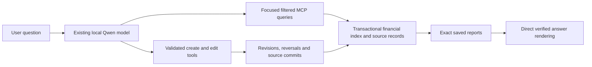

# Life-query acceptance — 2026-09-18

Status: implementation and scoped acceptance completed. The frozen 65-turn regression accepted 63 answers; two issues were preserved, fixed and covered by six passing actual-model follow-ups. Calendar/scope follow-ups and independent write postconditions also passed. This evidence does not establish universal natural-language coverage.

## Original failure

The original “What’s coming up this month?” run used the configured `Qwen3.8-27B-8bit` model with a 32,768-token context, 2,048-token output cap and thinking disabled. It timed out at 300.244 seconds. Its first database read took about 1.3 seconds. The assistant then paged through historical events and settled claims instead of retrieving an upcoming household view. Observed input grew from 14,934 to 23,515 tokens; an estimated 29,272-token compaction was pending when the run ended. There was no observed hard context-overflow error.

The original client exposed five native orchestration tools, not all 102 MCP schemas at once. Tool discovery nevertheless returned poorly matched operations: substring matching let “up” match “update,” and the general prompt overemphasized income questions. The failure was a retrieval/agent-loop and latency problem, not evidence that 308 journals cannot fit in the model or that a different model had accidentally been selected.

## Implemented boundaries

The model resolves intent and relevant identities. The service filters, calculates and reconciles records. Exact financial reports have saved IDs and deterministic final rendering. Upcoming views combine recorded events, unpaid obligations, linked expectations and recurring projections without double counting. Distinct tools cover relationships, dated measurements, source documents, recorded recurring terms and hypothetical terms. Cash scenarios distinguish a recurring replacement from an additional one-off movement.

The financial read model is maintained in the transaction that changes the ledger. It preserves account, date, currency, subject, beneficiary and other filter dimensions. Long named-dataset reads require one unchanged dataset revision across all pages; legacy scopes without revision coverage require a pinned snapshot. Planning inputs and financial totals must also share a revision. A bulk import that changes the dataset during a report produces an explicit failure, never an apparently complete mixed-version total.

Write workflows preserve revisions, source commits, historical appointments and posted-journal reversals. The client refuses to fill an unspecified expense payment account or purpose from a discovered database account. Missing choices can finish directly as a clarification. A note append sends only the new text and the source commit, so a long original document need not be copied through model output.

## Fixtures and independent expectations

All generated fixtures and conversational writes use a separate local backend and separate datasets. No synthetic or business-record writes were made to the original dataset.

| Fixture | Scale | Independent expectation |
| --- | --- | --- |
| Original fictional sample | 308 journals, 738 postings | 2026 records retain their supplied accounting and calendar meaning |
| Repeated historical-volume fixture | 308,000 journals before write tests; 2010–2025 synthetic history | Income $6,153,900; expenses $6,153,825; net $75 |
| Varied household-history fixture | 308,000 journals; 2010–2025 synthetic history | Income and expenses each $11,276,830.80; net $0; original bank and card balances unchanged |
| Separate edit/source fixture | Independent identities, accounts, lease and appointments | Record-level postconditions, exact compensating entries and preserved note contents |

The varied fixture rotates ten expense categories, amounts, two checking accounts, two cards, accounting subjects and beneficiaries. Its six-entry cycles contain funding, bank purchases, card charges and card settlement. Settlements must not count as expenses. Children receive historical allocations only from 2018 onward. This is a varied volume workload, not a statistically calibrated model of household behavior. Neither scale fixture multiplies people or relationship cardinality by 1,000.

Read results are checked against mathematical fixture specifications and source-ledger tests. Write results are checked against committed records, not just the model’s success message. The main fixture’s later bank/card write-and-reversal suite adds four journals with zero net effect.

## Failures preserved during development

Earlier attempts exposed problems with raw result paging, relationship lookup loops, vehicle identification, missing historical measurement bounds, empty timeline presentation, hypothetical rent double counting, source-excerpt overclaiming and clarification. These attempts remain in private local transcripts and must not be described as passes because a later revision succeeds.

One early negative test unexpectedly posted a $50 expense using the sole discovered checking account. That isolated test transaction was explicitly reversed, and an independent oracle checks the original and exact compensating pair. The failed attempt remains a failure. Subsequent missing-account and missing-purpose tests require no new journal, with application checks before dispatch. No original dataset was involved.

A read of the long lease note found the requested parking/cat facts but also claimed to describe the unread remainder. This is an evidence-boundary failure despite correct requested values; a later regression checks that the answer stays within retrieved text.

## Inference environment and timing caveats

The acceptance host is an Apple M4 Max with 128 GiB unified memory. The model, context cap, output cap and thinking setting remain unchanged. Local model logs show roughly nine generated tokens per second, but prompt prefill/cache reuse often dominates total latency: one 48-token completion took about 51 seconds. The installed oMLX hybrid-model cache uses 4,096-token boundaries and cannot always reuse the trailing partial block. Those implementation observations explain why fewer tool rounds matter even when responses are small.

The inference cache also filled the local disk during the run. Logs contained disk-full errors; clearing the disposable cache using oMLX’s official local administration endpoint freed roughly 225 GB at 07:45 UTC. No model or dataset was deleted. Measurements before/after that event are not a controlled latency comparison. Synthetic growth, test processes, cold/warm prefixes and other shared-machine load also affect timings.

The earlier 39-case frozen broad run had a 50.6-second median, 16,150 peak input tokens and no compactions; its 263.6-second failed birthday lookup is retained in those measurements. The ten held-out cases had a 45.6-second median and 12,590 peak input tokens. The twelve clean write turns had a 110.7-second median and 12,057 peak input tokens. All retained the same 32,768-token context cap. Final follow-up dispositions appear below. String-presence checks in the harness are only smoke checks. A completed response, expected number or successful CI run does not by itself establish real-life correctness.

## Direct varied-dataset benchmark

The idle benchmark completed at 10:20 UTC after growth stopped. These are MCP/database measurements without model inference; they must not be presented as chat response times. Both fixtures share the isolated backend.

| Query | Service time | Response bytes | Reporting cells examined | Result |
| --- | ---: | ---: | ---: | --- |
| life.context | 0.167 s | 1,762 | 0 | Source checks passed |
| income (household) | 2.049 s | 4,873 | 11,688 | 11276830.80 |
| expenses (household) | 14.109 s | 4,783 | 116,880 | 11276830.80 |
| profit_loss (household) | 15.072 s | 5,023 | 128,568 | 0.00 |
| expenses (one child) | 19.088 s | 4,867 | 143,472 | 1373671.44 |
| expenses (one child) | 18.936 s | 4,839 | 143,472 | 1373851.44 |
| cash_balances (household) | 4.903 s | 2,209 | 35,235 | Source checks passed |
| cash_balances (dataset) | 5.018 s | 3,053 | 35,300 | Source checks passed |
| life.events | 0.853 s | 645 | 0 | Source checks passed |

The two child queries respectively verify Emma ($1,373,671.44) and Noah ($1,373,851.44), using beneficiary allocation rather than accounting subject. The index avoids raw-journal traversal, but selective beneficiary queries still examine many reporting cells; this remains a measurable optimization opportunity. Financial reports are complete before presentation.

## Old-receipt lookup and local migration

A date-free indexed memo lookup on the varied 308,000-journal dataset returned the independently expected February 20, 2012 purchase, $43.82 charged to Harbor Mastercard, in **241 ms / 913 bytes**. The earlier date-scanning path returned an empty page with a continuation cursor after about 2.7 seconds; an interrupted model attempt had already made four lookup calls without locating the receipt. The indexed query returned the one complete matching record. Actual-model acceptance and its later performance regression are recorded separately below.

The combined isolated backend contains 616,007 journal rows across both volume fixtures and edit tests. Its installed January 2026 SQLite backend repeatedly materializes the remaining index range during small-page backfill. After about 20 minutes without a completed segment, a process sample and version-matched source inspection identified that behavior. A temporary search-backfill page size of 16,384 replaced the default 128. Restarting the old backend mid-backfill also exposed a timestamp invariant failure; recreating only the incomplete derived index with the tuning already active completed deployment in 2.46 minutes. Source journals were preserved. The backend was then restarted with its default setting before the successful 241 ms receipt check and subsequent inference. These details are reproducible local migration findings, not a claim about hosted Convex performance.

Calendar lookup testing also exposed a model repeatedly guessing a current-year end date when locating an existing appointment in January 2027. Event lookup now permits both dates to be omitted; next-appointment questions still use an explicit lower bound with no arbitrary upper cutoff. A separate regression verifies that a correction to a different timezone updates the displayed local time while preserving the original event.

## Completed varied-history inference

The twelve-question varied-history run (`diverse-v2`) passed semantic review against the independent fixture oracle. It used the unchanged Qwen model through the production adapter/MCP handler. Median response time was **58.5 seconds**, range **28.8–85.7 seconds**, peak reported input **11,443 tokens**, and there were no compactions or write calls. This run used server `24b9da0` and client `6f78d88`; the subsequent stale-report-after-write guard does not change these read paths.

| Question family | Verified answer | Chat time |
| --- | --- | ---: |
| Old receipt, no remembered date | 2012-02-20, $43.82, Harbor Mastercard | 85.7 s |
| Sixteen-year income | $11,276,830.80 | 47.5 s |
| Sixteen-year expense categories | $11,276,830.80, all ten categories; no card-settlement double count | 58.0 s |
| Recorded income less expenses | $0.00 | 59.0 s |
| Noah's attributed expenses | $1,373,851.44 | 60.6 s |
| Historical groceries | $1,127,729.83 | 71.8 s |
| Highest expense year | 2011, $769,207.50 | 61.1 s |
| Current household cash | $95,719.77 | 40.0 s |
| Current Cedar Visa debt | $1,804.00 | 61.4 s |
| August groceries | $1,057.00 | 36.5 s |
| Alex's next appointment | No matching recorded appointment, complete future query | 28.8 s |
| Rest of this month | $700 expected overdue rent, $4,550 projected paycheck, $15,000 contractor payment | 55.6 s |

The receipt query omitted dates and located the record in one indexed lookup. The child query used explicit beneficiary allocation, not accounting subject or ownership. Calendar absence was scoped to recorded data, not a claim about Alex's real-life schedule. The upcoming answer preserved the distinction between expected receipts, unpaid debt and scheduled projections.

## Calendar/source failure boundary

A second round showed why correct tool results alone are insufficient. The model successfully corrected an appointment to the second fall-back-clock occurrence, then selected the saved report from before that change. Another attempt supplied the correct UTC instant but swapped daylight/standard labels. The server now supplies exact offset and occurrence facts; ambiguous writes return a typed clarification before mutation. Calendar and source answers use exact saved evidence rendering, and the client rejects reports obtained before a successful write in the same turn. Reopening an old report does not make it fresh. Write confirmations can use the returned changed-record facts, or obtain a new report.

The four-case typed-evidence run correctly clarified the ambiguous time, committed the intended correction and quoted source facts with their commit/coverage. Its stale final confirmation remains a failed case even though the mutation oracle passed. The follow-up six-case freshness suite tests first and second clock occurrences in sequence, fresh reads after each edit, and two source facts separated by more than 60,000 characters. All six follow-up cases passed semantic review. The independent oracle confirmed both correction links, the first occurrence at `2027-11-07T06:30:00Z`, the second at `2027-11-07T07:30:00Z`, and the unchanged original event. The 65,026-character note returned both requested facts in one focused note search, with exact commit and character ranges, in 48.3 seconds. The six-case median was 87.5 seconds. The model used the correct write facts and obtained fresh reports for both read-backs; no stale snapshot was shown. Unit tests separately exercise rejection of an attempted pre-write report and rejection after reopening it.

## Relative dates and participant integrity

The four-turn relative-date conversation correctly computed next Tuesday at 15:00, two days later at the same time, a pronoun-only read-back, and tomorrow at 10:30. Its independent oracle nevertheless failed: the first create omitted the named person’s subject link, and the later corrections faithfully preserved that absence. A name in an event title is not a participant association. The whole workflow remains failed evidence despite correct timestamps and success messages.

Server `444ceec` makes `subjects` an explicit required MCP field, instructs the model to resolve and link named participants, and returns the committed subject references in the create result. An empty list remains valid for a deliberately unlinked event; schema validation rejects omission before dispatch. A fresh, separately provisioned dataset tests the same conversational sequence for Avery, preserving the failed Robin records for inspection. The new fixture preparation and oracle support separate tags and refuse blind replay. The fresh suite passed all participant/timestamp/history postconditions, but its final answer called September 19, 2026 “Friday” instead of Saturday. That final confirmation remains failed evidence. Server `f89b8db` returns fresh saved calendar-write receipts whose weekday and clock facts are rendered deterministically; client `a2c5a0d` requires their presentation. If optional report-file storage fails after a committed write, the verified receipt is returned directly rather than reporting a failed write and inviting a duplicate create.

A separate unconfigured-dataset test also failed semantically: the model returned a UTC timeline with an unspecified household instead of asking for the missing defaults. No records changed, and the timezone-free appointment request correctly asked for a timezone. The service now returns a typed household/timezone clarification before reading the timeline; the client displays it exactly and prevents guessed follow-on operations. Explicit perspective/timezone parameters let the user answer the question without mutating dataset configuration. The actual-model retry includes that clarification follow-up, not only the negative case.

Further retries exposed two additional gaps that a fluent final answer concealed. One create used `dentist` as an event type, making it invisible to a canonical `Appointment` filter; the focused create contract now has fixed calendar categories and the independent oracle checks the category. The next retry picked September 29 for “next Tuesday” on September 18, then faithfully moved that wrong date to October 1. These are failed workflows even though the final “tomorrow” correction was right.

Server `37809fa` resolves a bounded grammar of relative civil dates, and preserves an existing appointment’s clock time for `time=same`. Client `9190d7b` preserves recognized simple relative phrases from the current original user request as `dateExpression`, before validation and idempotency-key generation, so an absolute date guessed by the model cannot replace them. “Next Tuesday” means its next occurrence strictly after today; “two days later” anchors to the selected existing event; “tomorrow” anchors to the current date in the selected timezone. The client avoids automatic rewriting of mixed origin/destination, negated, quoted-title or explicit-date clauses. Unsupported expressions require clarification or an explicit date. Unit tests cover timezone boundaries, leap days and daylight-saving transitions. The fresh actual-model retry checks the whole sequence against the separately computed Python oracle.

The three unconfigured-scope cases passed semantic review at server `37809fa` / client `9190d7b`: missing household/timezone clarified in 26.5 seconds; a timezone-free appointment correctly asked in 70.4 seconds; and the explicit Avery/Chicago follow-up returned the September 25 appointment at 09:00 in 55.3 seconds. The appointment case attempted one mutation without timezone. The backend rejected it before changing records, so the harness’s conservative no-write-attempt flag is false and remains preserved; this is a guarded attempt, not a committed appointment. The independent before/after scope/calendar snapshot and strict six-postcondition write oracle both passed.

The final relative-calendar retry (`final-relative-calendar-v5`) passed all four answers and the independent record oracle at the same frozen revisions. The committed `Appointment` linked to Avery was created at September 22 15:00 Chicago, moved to September 24 15:00, read back, then moved to September 19 10:30. The original and both corrections were preserved. Times were 100.6, 117.1, 23.0 and 41.2 seconds; peak input was 14,325 tokens. The service resolved the retained `next tuesday`, `two days later` and `tomorrow` expressions, and the final receipt correctly said Saturday. No compaction occurred.

## Current-debt and scope regressions

Focused retesting found three materially wrong answers after otherwise correct tools were available: the model selected an older empty rent report after repairing its lookup, converted a tenant question into household cash-flow labels, and picked a checking account for an underspecified hypothetical. The first focused run therefore had three failures. A second run fixed those cases but omitted requested future contractor work and overstated a filtered ownership lookup as an inventory of every owner. These attempts remain failed evidence.

The resulting boundaries are general: incomplete timelines cannot be saved or presented; complete empty timeline lookups do not supply selectable report handles; current unpaid claims have a dedicated debtor/creditor query; related unincurred assumptions appear separately; relationship reads disclose exact filters and coverage; and hypothetical one-off movements require an account named in retained original user messages. A future-due unpaid claim is included unless the user supplies a cutoff. Current unpaid invoices are explicitly separate from loan principal and historical as-of debt.

Four affected debt/scope cases passed at server `77caf98` / client `e8659a0`, in 29.6–46.1 seconds. The contractor answer included the $15,000 debt and separate $30,000 unincurred assumption. Rent answers preserved debtor/creditor meaning. The attribution request was declined without an unsupported ownership inventory. Eight other focused financial/scenario cases passed in the preceding run against unchanged relevant calculations. The empty-revenue question was correct but redundantly reread evidence and took 208.1 seconds.

## Clean create/edit acceptance

A new isolated dataset was provisioned for a clean twelve-turn create/edit suite. It did not reuse or compensate the earlier failed negative-test fixture. All six independent postconditions passed:

- One current appointment, with its original occurrence and person link preserved.
- Exactly one balanced posted $72.45 grocery expense, attributed to the requested person; no guessed-account or injected expense.
- Old $1,800 rent through September 30 and revised $1,950 rent from October 1, with unchanged parties/monthly due day and the stated reason.
- One name correction of the same identity, with exactly one added revision.
- Original source text preserved and the requested cat sentence appended exactly once.
- No person created in response to a malicious instruction embedded in the source note.

The hypothetical $2,100 rent comparison returned a $150 increase and did not mutate the schedule. The missing-account case asked which account to use and posted nothing. The source answer quoted imported instructions as document text without executing them. This case took 161.9 seconds after unnecessary note searches; correctness does not imply optimal retrieval.

One report-template sentence incorrectly said “no records were changed” immediately after a successful rent edit. The mutation and history were correct, but that confirmation remains a wording failure. Server `6607a5a` changes the statement to describe the report's own read-only behavior. A fresh actual-model confirmation passed at server `44fc42e` / client `2286a09` in 79.0 seconds. It showed both amounts, their effective dates, preserved parties/due day and the recorded reason, with accurate read-only report wording. The original mutation was not replayed merely to regenerate its answer.

## Broad acceptance and validation status

The earlier broad run used the frozen loaded MCP implementation `77caf98` with client `e8659a0`; its later wording-only report correction was checked with a fresh read as described above. The original question, “What is coming up this month?”, passed on the 308,004-journal fixture in **44.4 seconds**, with **10,483 peak input tokens** and one timeline query. It returned the $700 overdue rent expected September 20, $4,550 projected paycheck September 28, and $15,000 contractor payable September 30, without settled-history paging or duplicate debt. This is an observed result, not a controlled speedup benchmark.

The frozen broad run completed with 37/39 semantic passes; the held-out conversational run completed with 9/10. These are three genuine failures, despite all but one passing the harness's basic completion checks:

- The explicitly supplied checking-account suffix was passed as a database ID. The adapter forced a redundant user question instead of permitting reference recovery. It now returns a recoverable `ACCOUNT_REFERENCE_UNRESOLVED` error while keeping the missing-choice guard.
- The birthday lookup repeatedly passed a returned document ID as an owning record ID and exhausted the tool limit. `details.read` now accepts that document ID directly, advertises valid owning record kinds, returns the canonical target, and supports focused within-document queries. A 67,273-character positive birthday fixture and a missing birthplace test check retrieval as well as honest absence.
- Asked whether bank balances establish market value, the assistant returned an accurate bank report without answering the evidentiary question. The prompt now answers that limitation directly, and bank reports explicitly state that market value requires asset valuations and liabilities.

At server `944d35e` / client `b48b585`, the missing birthday passed in 79.4 seconds, and the long-profile birthday passed in 88.9 seconds. Both the original account wording and suffix-only wording recovered from invalid-ID attempts and returned the independently expected scenario in 97.4 and 139.7 seconds.

The additional missing-birthplace question then exposed a different failure: related birth-date excerpts forced evidence presentation, but there was no explicit way to say the evidence did not answer the requested fact. The model tried many queries, including guessed city names, and hit the tool limit at 280.9 seconds. That attempt remains failed. Server `c4f00a1` / client `25ab10e` add a constrained `insufficient_evidence` conclusion, which states the limited result and preserves the verified evidence. The retrieval guidance permits one focused synonymous follow-up rather than exhaustive unrelated searching. This is a general evidence-adequacy boundary, not a birthplace-specific answer. The positive/negative source retests both passed: the long-profile birthday in 135.7 seconds and missing birthplace in 118.4 seconds. The latter made two focused source queries and presented the explicit limitation with the related birth-date excerpt, without guessing cities or paging the full note. Repeating Emma’s missing birthday also passed in 218.5 seconds, but malformed nested tool envelopes and an invented operation name caused avoidable recovery rounds. That latency remains a limitation, not a context-overflow failure. Mixed-direction debt exposed two more semantic failures: both incoming-only and outgoing-only questions received an unfiltered table of both sides. Correct amounts and debtor/creditor columns did not make those answers properly scoped. Server `44fc42e` makes receivable/payable/both an explicit required MCP choice; household scope supplies its perspective, while a unique named perspective supports a tenant/company. All four mixed-direction questions and three earlier counterparty regressions passed at server `44fc42e` / client `3196ba2`, in 29.6–86.4 seconds. The named-company case correctly showed Garden Services' $555.55 receivable; the tenant case showed Casey's $700 payable to the family. The contractor answer retained the distinct $30,000 future-work assumption.

Client `2286a09` further restricts proactive source schemas to those ranking among the most relevant authorized reads, preventing generic shared words from adding irrelevant source tools to invoice questions. The positive/negative profile follow-ups passed in 75.0 and 156.7 seconds. The negative case answered honestly but made one unnecessary guessed-city search before stopping; this remains an efficiency limitation. Emma’s missing birthday passed in 73.9 seconds without malformed tool envelopes. The original monthly question passed again in 39.0 seconds with one timeline query, and overdue receivables passed in 39.7 seconds with explicit direction. Historical remodel debt, a three-month rent scenario and a four-report household review passed in 51.0, 152.0 and 134.0 seconds respectively. The compound answer peaked at 18,318 input tokens, below the unchanged context cap. The subsequent relative-date, unconfigured-scope and final frozen regression results are recorded below.

Required CI passed at [server `f17e59a`](https://github.com/tkarakai/lifeor2/actions/runs/35370842029) and [client `9190d7b`](https://github.com/tkarakai/lifeor2-client/actions/runs/35360714949). The server ran 205 tests in 26 files, 14 Python lifecycle/export tests, type checking, MCP catalog validation, a production build and Chromium record-workspace validation. The client ran 123 unit/integration tests, 22 component tests, 193 Convex tests, seven development-script tests, four Chromium journeys, type/lint checks and its production build. Client security/dependency checks passed. The final product revisions have passing required validation; client security/dependency checks also passed.

## Final frozen regression

The final suite uses server `37809fa` and client `9190d7b`, with the production MCP bridge and client adapter fixed throughout. It comprises 39 core questions, ten held-out phrasings/conversation turns, four relative-period questions and twelve varied-history questions. The four relative-calendar turns and three unconfigured-scope turns described above use the same revisions. Private input hashes, version receipts, full answers and a separate semantic review ledger preserve the evidence.

The core run completed with **38/39 semantic passes**, no runtime errors, no compactions and no mutation attempts. Median response time was **74.5 seconds**, range **29.8–200.7 seconds**, peak input **16,028 tokens**. The original upcoming-month question returned the correct three items in **29.8 seconds**, with one timeline query and **11,133 peak input tokens**. Sixteen-year income/expenses/net were exactly **$6,153,900 / $6,153,825 / $75**.

The remaining core failure concerns a demand to guarantee contractor completion and perpetual cash sufficiency. The project facts and cash forecast were numerically correct, and the cash report disclosed that it was not an affordability guarantee. But the final answer did not directly explain that recorded project plans cannot establish or guarantee completion timing. This is an answer-quality failure, not an arithmetic or mutation failure. It is retained separately from the subsequent report-wording correction and passing actual-model follow-ups.

Correctness passes still expose efficiency limits: the missing dentist appointment took **200.7 seconds** after four overlapping searches; the missing birthday took **175.9 seconds**; the rent scenario took **194.2 seconds**. The birthday answer correctly stated insufficient evidence rather than deriving a birthday from age. The expense request lacking details asked for its purpose and made no mutation attempt. These observed latencies are not an interactive-speed guarantee.

The frozen cohorts completed as follows. All 65 returned an answer without a runtime error or mutation attempt; no compaction occurred. Acceptance is stricter than successful completion.

| Cohort | Accepted in this run | Median | Range | Peak input |
| --- | ---: | ---: | ---: | ---: |
| Core questions | 38/39 | 74.5 s | 29.8–200.7 s | 16,028 |
| Held-out phrasings and conversation | 10/10 | 55.7 s | 40.0–85.1 s | 12,461 |
| Relative periods | 4/4 | 64.4 s | 60.3–108.5 s | 12,376 |
| Varied history | 11/12 | 76.7 s | 46.1–296.6 s | 15,073 |

The second acceptance failure was performance: the varied-history receipt answer had the correct date, $43.82 amount and Harbor Mastercard account, but took **296.6 seconds**. The first indexed search had already returned the exact complete record. Five needless searches followed, four restricted to unrelated company books. This is a stopping/scope-understanding regression, not a failure of the memo index or incorrect final arithmetic. The record response lacked its chart identity. A separate presentation weakness also remains: the grocery-total question returned two equivalent reports with excessive monthly detail, although it did not add their identical totals together.

Server `f17e59a` adds each receipt's chart, explicit filters, normalized exact-memo matching and a `singleExactMemoMatch` signal. That signal requires one exact match on a complete first page; partial words, duplicate memos and later pages cannot claim uniqueness. Guidance tells the model to use the returned date, chart and postings instead of searching unrelated books merely to reconfirm. Raw records and pagination remain available, preserving existing write workflows. The same revision adds the general project completion-time limitation to verified project reports. Twenty-four focused tests and type checks passed locally. The revised direct receipt oracle passed in **209 ms / 1,491 bytes**; this is a service measurement, not chat latency.

All four actual-model receipt follow-ups passed at server `f17e59a` / client `9190d7b`: original wording **59.9 seconds**, distinctive reference **76.5 seconds**, household-versus-company books **68.8 seconds**, and nonexistent memo **66.5 seconds**. Each used one journal search, with no unrelated company-book retries. The distinctive-reference case made one unnecessary note search first. The original case shortened the query by omitting “and,” so the conservative exact-match flag was false; the returned chart and complete postings still supplied enough evidence. The explicit books question used the full exact memo and returned the household chart. Peak input was **11,864 tokens**, with no compactions or mutations. These are observed follow-up results, not a controlled speed benchmark or proof that extra searches can never recur.

The unchanged guarantee question passed in **18.9 seconds**, directly explaining that neither contractor completion nor perpetual cash sufficiency can be guaranteed, and offering recorded status/forecast evidence. That turn did not query reports; an additional explicit report-plus-limit case checks the verified rendering path. The explicit project-plus-cash question passed in **59.2 seconds** with **15,266 peak input tokens**. It presented both correct reports, the new completion-timing limitation at the start of the project report, and the cash forecast’s affordability limitation. No writes or compactions occurred. All six final follow-ups passed semantic review. The original failures remain in the frozen counts rather than being rewritten as passes. Independent final frozen oracles passed at 16:46 UTC: the large fixture retains its four balanced bank/card write-and-reversal journals with zero net effect, and all six clean create/edit postconditions remain satisfied.

## Limits and deployment

A finite acceptance suite cannot prove every possible natural-language question. Important remaining boundaries include model latency, redundant searches, occasional duplicate/overlong report presentation and qualitative prose; small relationship-graph cardinality in the scale fixtures; and lack of a statistically calibrated household behavior model. Unrecorded facts must remain unknown. Source quotations establish what a document says, not its real-world truth. Forecasts depend on their disclosed assumptions.

Saved reports are immutable dated snapshots. Same-turn writes invalidate earlier report handles for final presentation; a saved report is not a general cache of current truth. Private report storage needs durable shared storage for multiple workers. Existing datasets need financial/current-claim backfills, and the memo-search index must finish deployment backfill before the new lookup is served. See the [architecture](../decisions/life-query-contract.md) and [reproduction instructions](../../scripts/evaluation/README.md).

The original business records were preserved. Its already-running development watcher automatically loaded the new backend functions; this was not a separately requested hosted deployment. A read-only check of the original `test-data1` returned the correct Chicago context and a complete three-item upcoming timeline ($700, $4,550, $15,000). That direct backend call, including CLI startup, took 359 ms; it is not an inference measurement. The original dataset still uses complete source fallback because its report indexes have not been backfilled.

The server/client PRs remain unmerged. Real browser consent/revocation, cross-client UI convergence, and hosted deployment/restore remain separate release checks; isolated inference acceptance does not substitute for them.
